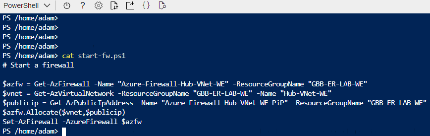
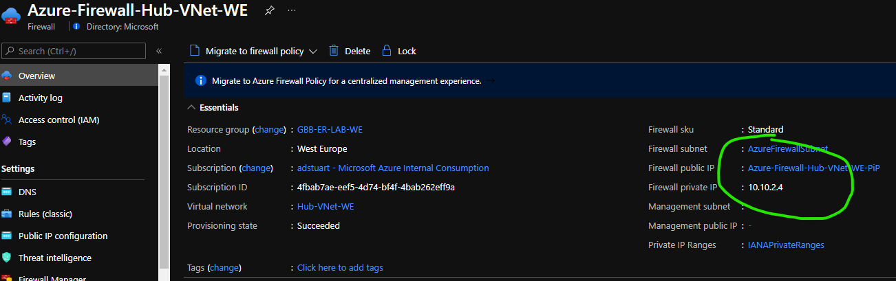
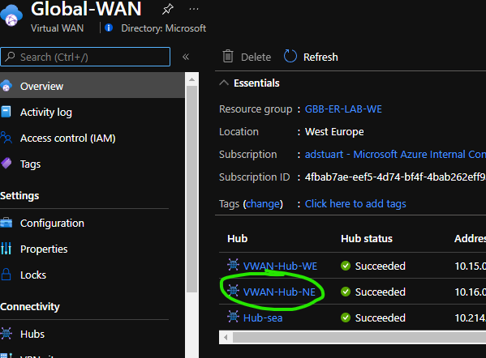
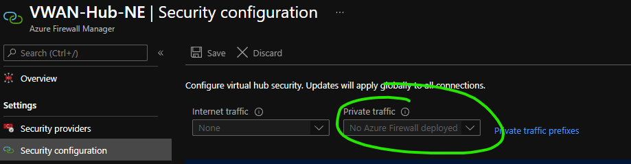
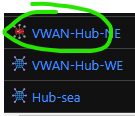
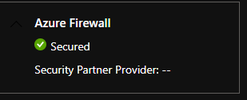
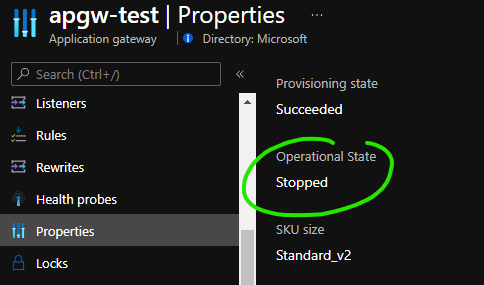
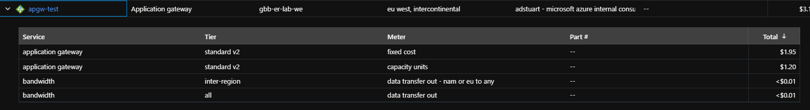
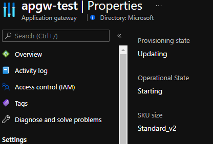
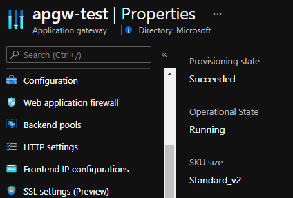

# Stop / Start Azure Firewall for lab/poc scenarios

# Introduction

[Azure Firewall](https://docs.microsoft.com/en-us/azure/firewall/) is a cloud native firewall that is [rapidly](https://azure.microsoft.com/en-gb/blog/upgrade-your-network-protection-with-azure-firewall-premium/) increasing in functionality. As one of the fastest growing Azure Networking products it is therefore natural that many customers want to trial and test these services within a lab scenario, prior to deployment in production.

In addition to this many individuals on learning tracks such as [Exam AZ-700: Designing and Implementing Microsoft Azure Networking Solutions](https://docs.microsoft.com/en-us/learn/certifications/exams/az-700) wish to get hands on experience to compliment their theoretical reading.

In these scenarios, simply leaving the Azure Firewall turned on 24/7 whilst labbing can be cost prohibitive. [Azure Firewall Pricing page](https://azure.microsoft.com/en-us/pricing/details/azure-firewall/)

- Azure Firewall standard SKU - ~£22 per day
- Azure Firewall premium SKU - ~£31 per day

These costs are the same if the Firewall is deployed [either](https://docs.microsoft.com/en-us/azure/firewall-manager/vhubs-and-vnets#comparison) inside, or outside of a Virtual Wan Hub.

## Stop/Start Azure Firewall

Luckily ARM exposes the required API to effectively pause your underlying Azure Firewall nodes. This in effect stops you paying for the underlying compute resources when you don't need to use them, for example when you are sleeping at night and not learning with your lab! I.e. You can treat your Azure Firewall like you would treat a lab IaaS Virtual Machine.

### Azure Firewall in customer-manged VNet

Official MS doc location [here](https://docs.microsoft.com/en-us/powershell/module/az.network/set-azfirewall?view=azps-6.5.0#4--deallocate-and-allocate-the-firewall).

I make heavy use of this myself, building complex topologies that utilise Azure Firewall, and then simply shutting down my instances when not in use. To make this super simple, I package the allocation and deallocation commands as scripts, hosted in my Azure Cloud Shell directory. Let's take a look at the user experience;

- I login to the portal and wish to utilise my Azure Firewall, notice how the resource itself does not have any IPs allocated or even an assignment to a virtual network. This is my Azure Firewall in a dormant deallocated state. 

> :bulb: You are not paying for Azure Firewall node resource costs when your Firewall is deallocated!


- I launch Cloud Shell from the portal and my ```start-fw.ps1``` script is located in my home directory



```
$azfw = Get-AzFirewall -Name "Azure-Firewall-Hub-VNet-WE" -ResourceGroupName "GBB-ER-LAB-WE"
$vnet = Get-AzVirtualNetwork -ResourceGroupName "GBB-ER-LAB-WE" -Name "Hub-VNet-WE"
$publicip = Get-AzPublicIpAddress -Name "Azure-Firewall-Hub-VNet-WE-PiP" -ResourceGroupName "GBB-ER-LAB-WE"
$azfw.Allocate($vnet,$publicip)
Set-AzFirewall -AzureFirewall $azfw
```

- Let's run the script. 

> :warning: Ensure you are within a PowerShell Cloud Shell, not bash, otherwise you will get access denied upon script initiation

```
PS /home/adam> ./start-fw.ps1

Name                        : Azure-Firewall-Hub-VNet-WE
ResourceGroupName           : GBB-ER-LAB-WE
Location                    : westeurope
Id                          : /subscriptions/4fbab7ae-eef5-4d74-bf4f-4bab262eff9a/resourceGroups/GBB-ER-LAB-WE/providers/Microsoft.Network/azureFirewalls/Azure-Firewall-Hub-VNet-WE
Etag                        : W/"2fd884dc-868a-4738-bd8f-0826b3a192c8"
ResourceGuid                :
ProvisioningState           : Succeeded
<snip>
```

- It takes around seven minutes for the allocation to happen and the API to report success, after which your firewall data-plane is reinstated and ready for use! Notice updated status below.



- Once I've finished labbing, I simply run my ```stop-fw.ps1``` script to return the firewall to its deallocated state, which stops me incurring the hourly FW charge.

```
PS /home/adam> cat ./stop-fw.ps1
# Stop an existing firewall

$azfw = Get-AzFirewall -Name "Azure-Firewall-Hub-VNet-WE" -ResourceGroupName "GBB-ER-LAB-WE"
$azfw.Deallocate()
Set-AzFirewall -AzureFirewall $azfw
```

### Azure Firewall in Virtual WAN Hub _aka Secured Virtual Hub_

We can now do the same thing with Azure Firewall inside of a Virtual WAN Hub. Official MS doc location [here](https://docs.microsoft.com/en-us/powershell/module/az.network/set-azfirewall?view=azps-6.5.0#12--deallocate-and-allocate-the-firewall-from-a-virtual-hub).

- I login to the portal and wish to utilise my Secured Virtual Hub within my North Europe hub, notice how the Virtual WAN hub itself shows as a regular VWAN hub whilst  my Azure Firewall in a dormant deallocated state. 

> :bulb: You are not paying for Azure Firewall resource costs when your Firewall is deallocated!



In fact even within Azure Firewall Manager, in this dormant state the firewall is effectively not deployed.



- I launch Cloud Shell from the portal and my ```allocate-securedhubfw.ps1``` script is located in my home directory

```
PS /home/adam> cat allocate-securedhubfw.ps1
# Stop an existing firewall
$virtualhub = get-azvirtualhub -ResourceGroupName gbb-er-lab-we -name vwan-hub-ne
$firewall = Get-AzFirewall -Name "AzureFirewall_VWAN-Hub-NE" -ResourceGroupName "GBB-ER-LAB-WE"
$firewall.Allocate($virtualhub.Id)
$firewall | Set-AzFirewall
```

- Let's run the script. 

```
PS /home/adam> ./allocate-securedhubfw.ps1
Name                        : AzureFirewall_VWAN-Hub-NE
ResourceGroupName           : GBB-ER-LAB-WE
Location                    : northeurope
Id                          : /subscriptions/4fbab7ae-eef5-4d74-bf4f-4bab262eff9a/resourceGroups/GBB-ER-LAB-WE/providers/Microsoft.Network/azureFirewalls/AzureFirewall_VWAN-Hub-NE
Etag                        : W/"2046b496-20be-42bb-9887-02c1c9ef49e0"
ResourceGuid                :
ProvisioningState           : Succeeded
<snip>
VirtualHub                  : Microsoft.Azure.Management.Network.Models.SubResource
HubIPAddresses              : Microsoft.Azure.Commands.Network.Models.PSAzureFirewallHubIpAddresses
<snip>
```

- It takes around seven minutes for the allocation to happen and the API to report success (much faster than it would take the API to re-deploy a full Azure Secured Virtual Hub from scratch), after which your firewall data-plane is reinstated and ready for use! Notice updated hub status below (red hub icon).

 

- Once I've finished labbing, I simply run my ```deallocate-securedhubfw.ps1``` script to return the firewall to its deallocated state, which stops me being charged.

```
PS /home/adam> cat deallocate-securedhubfw.ps1
# Stop an existing firewall
$firewall = Get-AzFirewall -Name "AzureFirewall_VWAN-Hub-NE" -ResourceGroupName "GBB-ER-LAB-WE"
$firewall.Deallocate()
$firewall | Set-AzFirewall
```

## Bonus! Stop/Start Azure Application Gateway

Adding here for completeness, but also covered at:

- https://rlevchenko.com/2020/07/28/how-to-stop-azure-application-gateway/
- https://laurakokkarinen.com/stopping-and-starting-azure-application-gateway-on-demand-and-on-a-schedule/

We can apply the same trick with Azure Application Gateway. Allowing you to keep the control plane (configuration, frontend, listeners, rules etc) in place, whilst only utilising the dataplane when you require it.

[Azure Application Gateway pricing page](https://azure.microsoft.com/en-gb/pricing/details/application-gateway/) - From £4.30 per day

Official MS doc location [here](https://docs.microsoft.com/en-us/powershell/module/azurerm.network/stop-azurermapplicationgateway?view=azurermps-6.13.0) and [here](https://docs.microsoft.com/en-us/powershell/module/azurerm.network/start-azurermapplicationgateway?view=azurermps-6.13.0).

- I login to the portal and wish to utilise my Azure Application Gateway for a lab scenario, notice how the resource is in a stopped state.



> :bulb: You are not paying for Application Gateway fixed gateway hour resource costs when your APGW is stopped

E.g. Here are my application gateway costs for the entire month of October. My resource was provisioned for this entire time, but was only started for a few hours.




- I launch Cloud Shell from the portal and my ```start-apgw.ps1``` script is located in my home directory

```
PS /home/adam> cat start-apgw.ps1
$AppGw = Get-AzureRmApplicationGateway -Name "apgw-test" -ResourceGroupName "GBB-ER-LAB-WE"
Start-AzureRmApplicationGateway -ApplicationGateway $AppGw
```
- Let's run the script. 

```
PS /home/adam> ./start-apgw.ps1

Sku                                 : Microsoft.Azure.Commands.Network.Models.PSApplicationGatewaySku
SslPolicy                           :
GatewayIPConfigurations             : {appGatewayIpConfig}
AuthenticationCertificates          : {}
SslCertificates                     : {}
TrustedRootCertificates             : {}
TrustedClientCertificates           : {}
FrontendIPConfigurations            : {appGwPublicFrontendIp, appGwPrivateFrontendIp}
<snip>
OperationalState                    : Running
ProvisioningState                   : Succeeded
```

Whilst the script is running, the status of Application Gateway will show as updating/starting.




- It takes around five minutes for the allocation to happen and the API to report success, after which your APGW data-plane is reinstated and ready for use! Notice updated status below.



- Once I've finished labbing, I simply run my ```stop-apgw.ps1``` script to return the APGW to its stopped state, which stops me incurring the hourly APGW charge.

```
PS /home/adam> cat stop-apgw.ps1
$AppGw = Get-AzureRmApplicationGateway -Name "apgw-test" -ResourceGroupName "GBB-ER-LAB-WE"
Stop-AzureRmApplicationGateway -ApplicationGateway $AppGw
```

